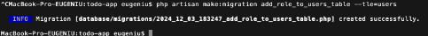

# Sarcina nr.1. Pregătirea lucrării

Am continuat in proiectul anterior.
M-am asigurat că fisierul ```.env``` este configurat corect pentru a permite conectarea aplicatiei Laravel la baza de date.


# Sarcina nr.2. Autentificarea utilizatorului

Am creat un controller ```AuthController``` pentru gestionarea autentificarii utilizatorilor


Aici am adaugat metodele pentru inregistrare , autentificare si deconectarea utilizatorului 
-```register()``` pentru afisarea formularului de inregistrare
-```storeRegister()``` pentru procesarea datelor din formularul de inregistrare 
-```login()``` pentru afisarea formularului de autentificare
-```storeLogin()``` pentru procesarea datelor din formularul de autentificare


Apoi am adaugat rute pentru inregistrare , autentificare si deconectarea utilizatorului ```routes/web.php```


Am creat vizualizari pentru formularul de inregistrare ```resources/views/auth/register.blade.php```


si pentru autentificare ```resources/views/auth/login.blade.php```


Am creat o clasa ```Request``` pentru validarea datelor


In fisierul ```app/Http/Requests/RegisterRequest.php``` am configurat regulile de validare:


Si am folosit aceasta clasa in storeRegister


# Sarcina nr.3. Autentificarea utilizatorilor cu ajutorul componentelor existente

Aceasta sarcina am efectuat-o dupa ce am facut sarcinile principale. Am instalat biblioteca Laravel Breeze
-```php artisan breeze:install```
-```npm install && npm run dev```


# Sarcina nr.4. Crearea unei clase de cerere personalizată (Request)

Am creat un controller ```DashboardController``` pentru a gestiona functionalitatea paginii ***Panou personal***


In fisierul ```DashboardController``` am adaugat metoda index


Am configurat verificarea accesului la aceasta pagina , adaugind middleware-ul ```auth ``` in ruta. 
Aceasta ruta foloseste middleware-ul auth pentru a permite accesul doar utilizatorilor autentificati.


Am creat vizualizarea paginii ***Panou personal*** , ca sa se afiseze informatiile disponibile


# Sarcina nr.5. Rolurile utilizatorilor

Am creat o migrare
Un cimp role în tabelul users pentru a stoca rolul utilizatorului.



In fisier am adaugat metoda ```up()``` si ```down()```: 
**Metoda up()**:
- Este folosită pentru a aplica modificările bazei de date, cum ar fi adăugarea unei coloane noi.
- În acest caz, adaugă coloana role în tabelul users.

**Metoda down()**:
- Este folosită pentru a reveni asupra modificărilor făcute de metoda up().
- În acest caz, șterge coloana role din tabelul users.

```database/migrations/2024\_12\_03\_183247\_add\_role\_to\_users\_table.php```


Am rulat migrarea


Acest cod defineste o regula de autorizare utilizind Gate, care permite accesul la vizualizarea tuturor panourilor doar utilizatorilor cu rolul de admin.
```App\Providers\AuthServiceProvider.php```


Am actulizat ```DashboardController``` ca sa se diferentieze comportamentul Administratorului si Utilizatorului


# Sarcina nr.6. Deconectarea si protectia impotriva CSRF

In fisierul ```dashboard.blade.php``` , am adaugat un formular pentru deconectare .

Laravel necesita utilizarea metodei ```POST``` pentru actiuni de deconectare, protejată de un ```token CSRF```.


In fisierul ```routes/web.php```, am configurat ruta pentru deconectare


In ```AuthController``` am implementat functia ```logout```. 
Utilizatorul se va deconecta si va fi trimis catre pagina principala.


## Intrebari de control

**1.** ***Ce soluții integrate pentru autentificare oferă Laravel?***

Laravel ofera mai multe solutii integrate pentru autentificare. Printre acestea se numara:
***Laravel Breeze***, care este o optiune simpla si usor de personalizat pentru autentificare si managementul utilizatorilor.
O solutie mai avansata este ***Laravel Jetstream***, care include autentificare, gestionarea echipelor, sesiuni multiple si suport pentru autentificare cu doi factori (2FA).
Pentru aplicatii API, ***Laravel Sanctum*** este o optiune excelenta, oferind autentificare simpla si sigura pentru aplicatii mobile sau SPA.
De asemenea, ***Laravel Passport*** este folosit pentru autentificare pe baza de OAuth2, fiind potrivit pentru aplicatii mai complexe.

**2.** ***Ce metode de autentificare a utilizatorilor cunoașteți?***

Exista mai multe metode de autentificare a utilizatorilor.
***Autentificarea pe baza de sesiuni*** implica salvarea datelor utilizatorului intr-o sesiune activa pe server.
***Autentificarea prin token-uri*** utilizeaza un token unic pentru fiecare utilizator autentificat, fiind utilizata de Sanctum sau Passport.
***Autentificarea prin OAuth2*** permite utilizatorilor sa se conecteze cu conturi externe, precum Google sau Facebook.
***Autentificarea cu doi factori (2FA)*** adauga un strat suplimentar de securitate, solicitand coduri suplimentare trimise prin email sau SMS.
Exista si ***autentificarea fara parola***, unde utilizatorii se conecteaza folosind un link unic trimis pe email.

**3.** ***Care este diferența dintre autentificare și autorizare?***

***Autentificarea*** si ***autorizarea*** sunt doua concepte diferite.
***Autentificarea*** este procesul de verificare a identitatii unui utilizator, similar cu prezentarea unui buletin la intrare. In Laravel, acest lucru poate fi realizat cu metode precum ```Auth::attempt()```. ***Autorizarea***, pe de alta parte, verifica daca utilizatorul are permisiuni pentru anumite actiuni, cum ar fi accesul la zone restranse. In Laravel, autorizarea se poate face cu ```Gate::allows()``` sau middleware-uri care controleaza permisiunile.

**4.** ***Cum se asigură protecția împotriva atacurilor CSRF în Laravel?***

Protejarea impotriva atacurilor CSRF (Cross-Site Request Forgery) este integrata in Laravel. Acest lucru se realizeaza folosind ***token-uri CSRF***, care sunt generate automat pentru fiecare sesiune. Aceste token-uri trebuie incluse in formulare folosind directiva @csrf. Cand un formular este trimis, serverul verifica validitatea token-ului. Daca acesta lipseste sau este incorect, cererea este respinsa. Middleware-ul VerifyCsrfToken din Laravel se ocupa de aceste verificari, asigurand ca aplicatia este protejata impotriva cererilor neautorizate.
